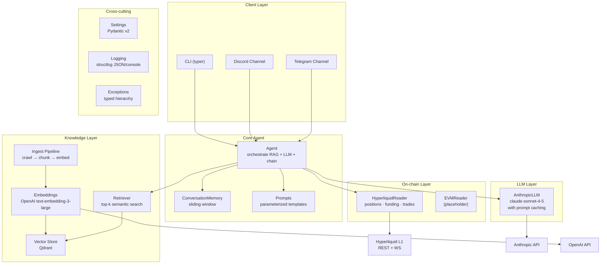
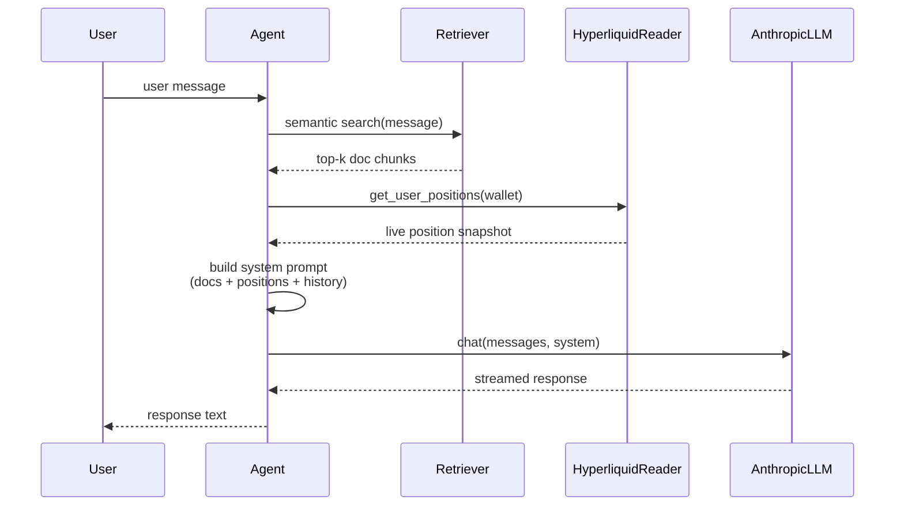

# Architecture

## System Overview

## Data Flow: User Query

## Module Dependency Rules

- `config`, `logging`, `exceptions` — no internal dependencies (foundation layer)
- `llm`, `chains` — depend on foundation only
- `knowledge` — depends on `llm` (for embeddings)
- `agent` — depends on `knowledge`, `chains`, `llm`
- `channels`, `cli` — depend on `agent`

**Rule:** lower layers NEVER import from higher layers.
